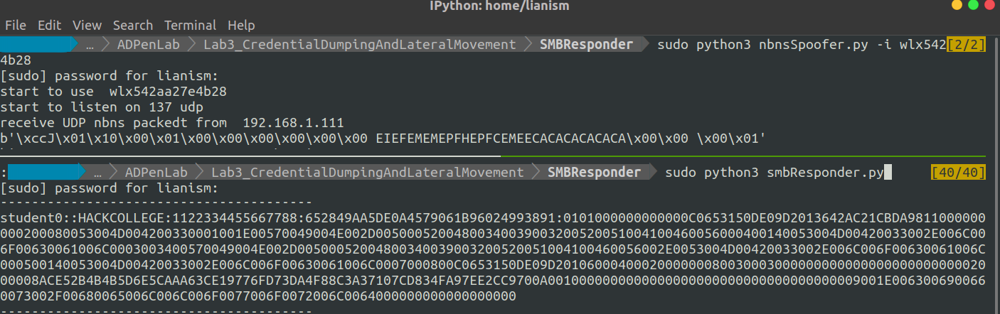
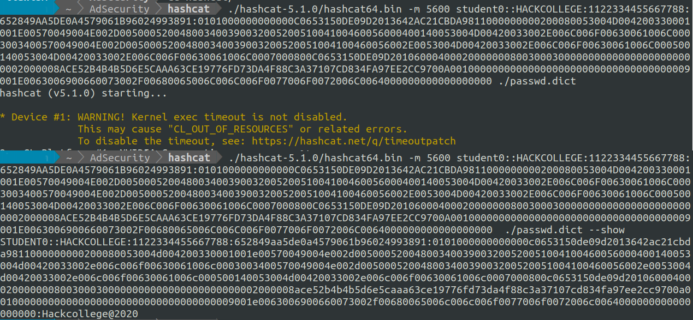

# SMB responder simple implementation

1. This lab can't do in cloud environment due to  Cloud is SDN, run it on vm and make sure it's bridge mode
1. First run nbnsSpoofer to deceive the target computer who is broadcasting who has NetBIOS name XXXX
1. Run the smbResponder in the same time to get the Net NTLM credential 

1. Using HashCat to crack the dumped credential

